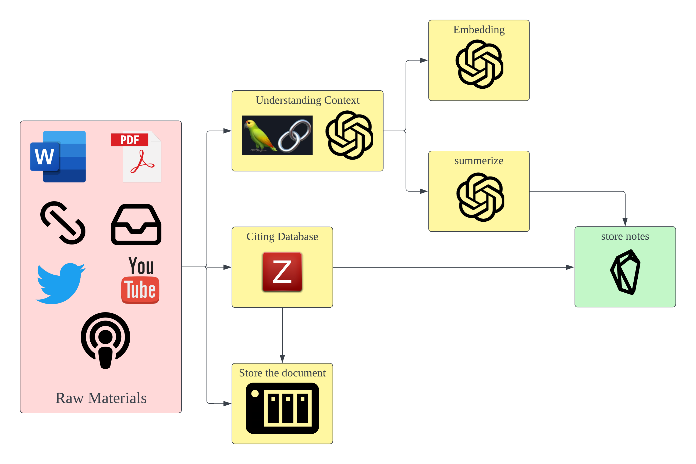
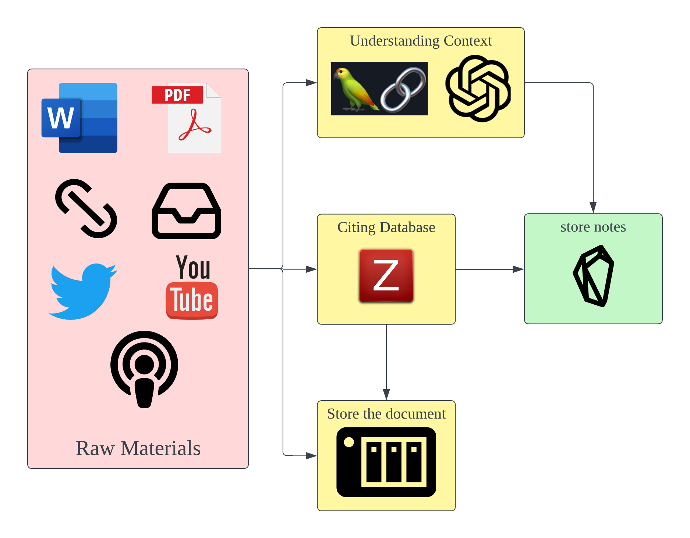
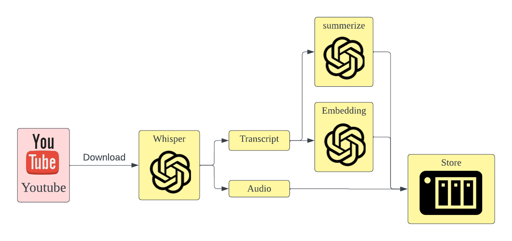

## Cognimesh
- Yes, this is another second brain repository
- I try to code a personal knowledge management system for myself

### Target of this project: 
Updated 11/7/2023:
- Ingest all documents, videos, audio, URLs and make notes about them
- Create essays and provide sources on specific topics I requested

### Draft structure:
Updated 15/7/2023:

Updated 11/7/2023:


### Package installed: [environment.yml](environment.yml)

### Document loader:
[pdf_loader]()
#### Prerequisite: Zotero with [Better BibTex](https://retorque.re/zotero-better-bibtex/) plugin 
- select all your items in Zotero, right-click, better bibtex, pin citation keys
- Better BibTex preference: Automatically pin citation key after set non-zero value


### YouTube Loader

[yt_loader](yt_loader.py)


## Postgresql + vector store
1. Create a database in your postgresql instance (I use the name cognimesh)
```bash
export PGPASSWORD=<your_password>
psql -U postgres -h <hostname>
```
```sql
CREATE DATABASE cognimesh;
CREATE USER <your-username> WITH PASSWORD <your-password> SUPERUSER;
GRANT ALL PRIVILEGES ON DATABASE cognimesh TO <your-username>;
```
2. 


